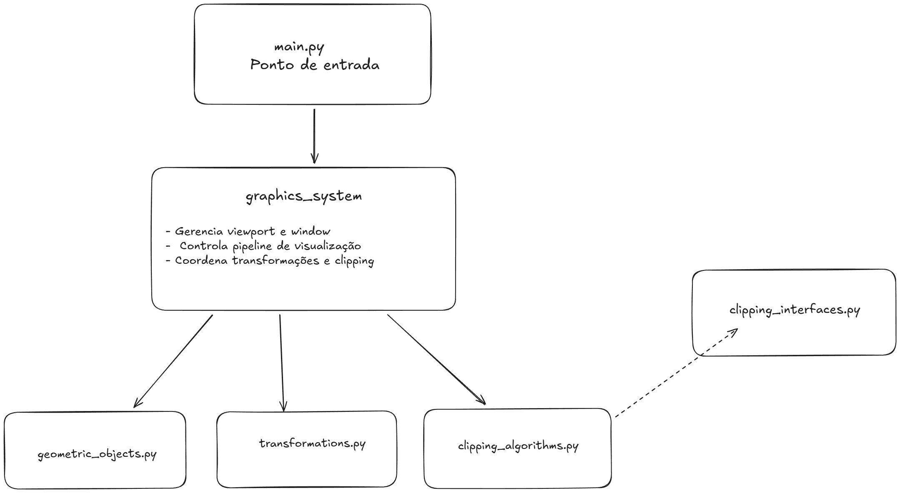

# Sistema Gráfico com Clipping - TP2

Sistema gráfico 2D com transformações geométricas e algoritmos de clipping implementado em Python com arquitetura modular, NumPy e interfaces abstratas.

## 🚀 Como Executar

```bash
# Instalar dependências
pip install -r requirements.txt

# Executar
python main.py
```

**Requisitos**: Python 3.7+ com NumPy e Tkinter

## 📖 Uso Rápido

### 1. Carregar Cena
- Clique em **"Carregar XML"**
- Selecione o arquivo `entrada_teste.xml` (ou `entrada (1).xml`)

### 2. Controles

#### Movimentação
- **↑ ↓ ← →**: Mover window
- Ajuste o **passo** (padrão: 1.0 unidade)

#### Rotação
- **↶ Esquerda / Direita ↷**: Girar window
- Ajuste o **ângulo** (padrão: 15°)

#### Zoom
- **+ Ampliar**: Reduz window em 10% (zoom in)
- **− Reduzir**: Aumenta window em 10% (zoom out)

### 3. Algoritmos

Escolha o algoritmo de clipping para retas:
- ⚪ **Cohen-Sutherland** (clássico)
- ⚪ **Liang-Barsky** (eficiente)

*Polígonos usam automaticamente Sutherland-Hodgman*

## 📁 Arquitetura Modular



```
clipping/
├── main.py                  # Ponto de entrada da aplicação
├── graphics_system.py       # Sistema gráfico principal (SistemaGrafico)
├── geometric_objects.py     # Classes de objetos (Ponto, Reta, Poligono)
├── transformations.py       # Operações de transformação com NumPy
├── clipping_algorithms.py   # Implementações dos algoritmos de clipping
├── clipping_interface.py    # Interfaces abstratas (ABC)
├── xml_loader.py            # Carregador de arquivos XML
├── entrada_teste.xml        # Arquivo de teste
├── requirements.txt         # Dependências (numpy)
├── Documentacao_TP2.md      # Documentação detalhada
└── README.md                # Este arquivo
```

### Descrição dos Módulos

| Módulo                   | Responsabilidade                                                              |
| ------------------------ | ----------------------------------------------------------------------------- |
| `main.py`                | Ponto de entrada, inicializa a aplicação                                      |
| `graphics_system.py`     | Classe `SistemaGrafico` - pipeline de visualização                            |
| `geometric_objects.py`   | Classes `Ponto`, `Reta`, `Poligono` com coords NumPy                          |
| `transformations.py`     | Classe `Transformacao` - matrizes homogêneas 3x3                              |
| `clipping_algorithms.py` | `ClippingCohenSutherland`, `ClippingLiangBarsky`, `ClippingSutherlandHodgman` |
| `clipping_interface.py`  | Interfaces abstratas `ClippingAlgorithmReta`, `ClippingAlgorithmPoligono`     |
| `xml_loader.py`          | Classe `XMLLoader` - parsing de arquivos XML                                  |

## 🎨 Formato do XML

```xml
<?xml version="1.0"?>
<dados>
    <viewport>
        <vpmin x="0" y="0"/>
        <vpmax x="800" y="600"/>
    </viewport>
    
    <window>
        <wmin x="0.0" y="0.0"/>
        <wmax x="10.0" y="7.5"/>
    </window>
    
    <ponto cor="red" x="5.0" y="3.0"/>
    
    <reta cor="blue">
        <ponto x="1.0" y="1.0"/>
        <ponto x="5.0" y="5.0"/>
    </reta>
    
    <poligono cor="green">
        <ponto x="2.0" y="2.0"/>
        <ponto x="4.0" y="2.0"/>
        <ponto x="3.0" y="4.0"/>
    </poligono>
</dados>
```

## ✨ Recursos Implementados

✅ Transformações da window (translação, rotação, escala)  
✅ Pipeline completo: Mundo → PPC → Viewport  
✅ Clipping de pontos, retas e polígonos  
✅ Cohen-Sutherland para retas  
✅ Liang-Barsky para retas  
✅ Sutherland-Hodgman para polígonos  
✅ Interface gráfica intuitiva  
✅ Suporte a cores X11  
✅ Visualização da área de clipping (bordas da window)  

### Melhorias de Arquitetura

✅ **NumPy** para operações matriciais eficientes  
✅ **Arquitetura modular** com separação de responsabilidades  
✅ **Interfaces abstratas (ABC)** para extensibilidade  
✅ **Type hints** para documentação e segurança de tipos  

## 🧪 Testes Sugeridos

1. **Teste básico**: Carregue `entrada_teste.xml` e explore com os botões
2. **Teste de movimento**: Use as setas para navegar pela cena
3. **Teste de rotação**: Gire a window gradualmente
4. **Teste de zoom**: Amplie e reduza para ver diferentes escalas
5. **Teste de algoritmos**: Alterne entre Cohen-Sutherland e Liang-Barsky

## 📊 Informações em Tempo Real

O painel lateral mostra:
- Coordenadas da window (min, max, centro)
- Ângulo de rotação atual
- Quantidade de objetos (total e visíveis)
- Algoritmo de clipping selecionado

## 🎯 Decisões de Implementação

### Estrutura de Dados
- Objetos mantêm coordenadas **originais** (mundo) e **transformadas** (PPC)
- Atributo `visivel` indica se objeto passou no clipping
- Polígonos podem ter múltiplos resultados após clipping

### Transformações
- Movimentação considera rotação da window
- Rotação e escala sempre em relação ao centro
- Matrizes homogêneas 3x3 para todas transformações

### Clipping
- Pontos: teste simples de inclusão
- Retas: escolha entre 2 algoritmos
- Polígonos: Sutherland-Hodgman

## 🐛 Problemas Conhecidos

- Performance pode ser afetada com 1000+ objetos
- Erros de ponto flutuante podem acumular após muitas rotações
- Sutherland-Hodgman pode não gerar múltiplos polígonos em casos muito complexos

## 📚 Documentação Completa

Veja `Documentacao_TP2.md` para:
- Fundamentação teórica detalhada
- Explicação de cada algoritmo
- Diagramas de arquitetura
- Uso de NumPy para matrizes
- Interfaces abstratas (ABC)
- Mais exemplos de uso
- Referências bibliográficas

## 👤 Autores

- Artur Neto
- Breno Vambaster
IFNMG - Campus Montes Claros  
Computação Gráfica - 2025

## 📄 Licença

Este projeto foi desenvolvido para fins acadêmicos.

---

**Dica**: Experimente rotacionar a window em 45° e depois movimentar - a window se move na direção "local" dela! 🎮